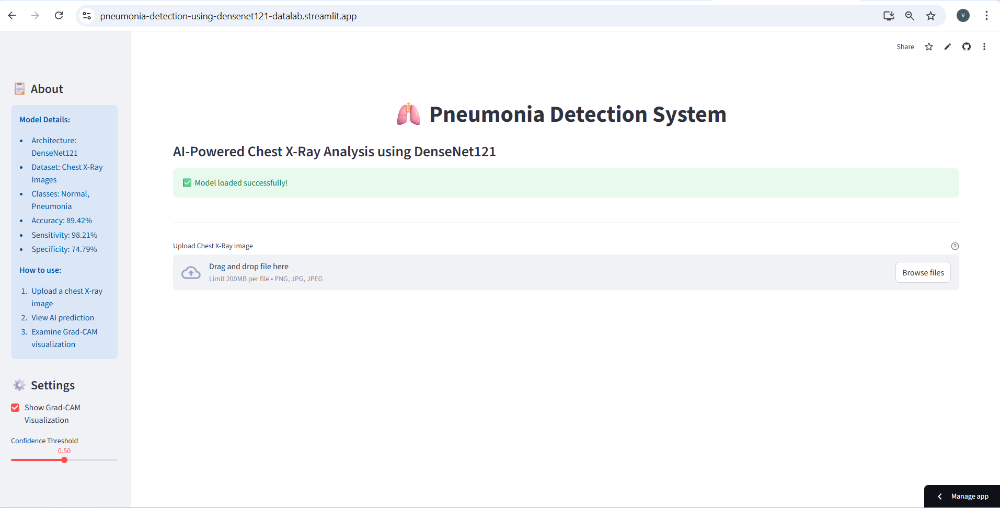
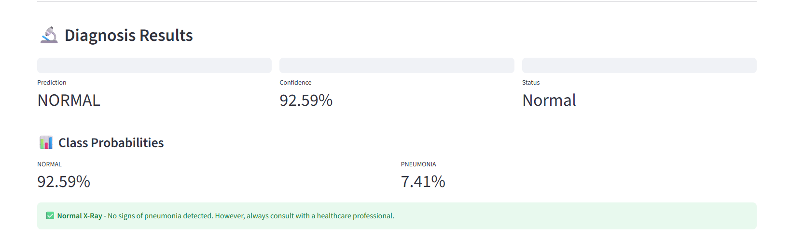
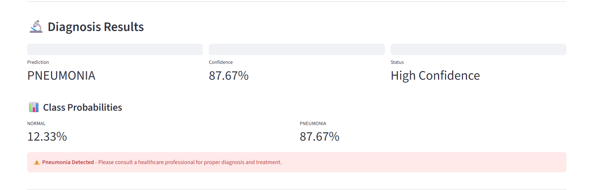
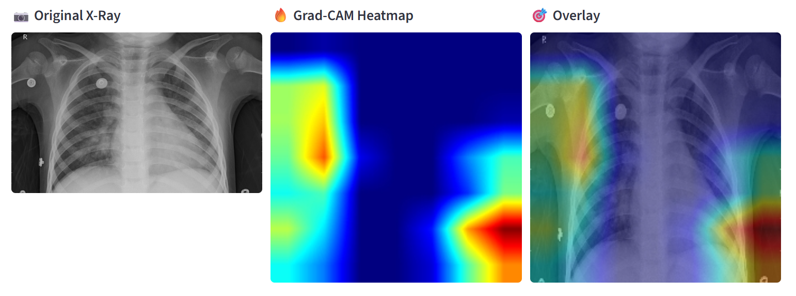

# 🫁 Pneumonia Detection Using Deep Learning
<div align="center">

[](https://pneumonia-detection-using-densenet121-datalab.streamlit.app/)
[](https://www.python.org/)
[](https://www.tensorflow.org/)


</div>

A deep learning web application for detecting pneumonia from chest X-ray images using transfer learning with DenseNet121, deployed with Streamlit.

## 🎯 Project Overview
This project implements a deep learning model to classify chest X-ray images as either **NORMAL** or **PNEUMONIA**. Built with DenseNet121 architecture and deployed on Streamlit Cloud, it provides real-time pneumonia detection with explainable AI features.

### ✨ Key Features

- **🧠 Transfer Learning:** Leverages pretrained DenseNet121 on ImageNet
- **🎯 High Performance:** 89.42% accuracy with 98.21% sensitivity
- **🔍 Explainable AI:** Grad-CAM visualizations show model focus areas
- **🌐 Live Web App:** Deployed on Streamlit Cloud for instant access
- **📊 Medical Metrics:** Sensitivity, specificity, precision, and F1-score
- **💻 User-Friendly:** Simple drag-and-drop interface


## 🚀 Live Demo
**Try it now:** [Pneumonia Detection App](https://pneumonia-detection-using-densenet121-datalab.streamlit.app/)

Simply upload a chest X-ray image and get instant predictions with visual explanations!

## 📸 Screenshots
- **Main Interface**


_Upload your chest X-ray and get instant predictions_

- **Prediction Results**
   - NORMAL 
     
     
       _Example: Normal chest X-ray classification_
   - PNEUMONIA 
     
     
      _Example: Pneumonia detection with confidence score_
- **Grad-CAM Visualization**


_Heatmap showing which regions the AI focuses on for diagnosis_

## 🎬 Demo Video


_Quick demo of the pneumonia detection process_

## 📊 Model Performance
| Metric | Score |
|--------|-------|
| Accuracy | 89.42% |
| Sensitivity (Recall) | 98.21% |
| Specificity | 74.79% |
| Precision | 86.65% |
| F1-Score | 92.07% |

## 🎯 Confusion Matrix
|  | 🔵 Predicted NORMAL | 🔴 Predicted PNEUMONIA |
|---|:---:|:---:|
| **🔵 Actual NORMAL** | ✅ 175 (TN) | ❌ 59 (FP) |
| **🔴 Actual PNEUMONIA** | ❌ 7 (FN) | ✅ 383 (TP) |

_TN=True Negative, FP=False Positive, FN=False Negative, TP=True Positive_

**Key Insight:** The model achieves 98.21% sensitivity, meaning it correctly identifies 98 out of 100 pneumonia cases - critical for medical screening applications.

## 🏗️ Architecture
**Model Pipeline**
1. **Base Model:** DenseNet121 (pretrained on ImageNet)
2. **Custom Head:**
      - Global Average Pooling
      - Dense Layer (256 units) + ReLU
      - Dropout (0.5)
      - Output Layer (2 units) + Softmax
3. **Training Strategy:**
     - Phase 1: Train top layers with frozen base
     - Phase 2: Fine-tune last 30 layers
     - Data augmentation for robustness

**Data Augmentation**
- Rotation: ±15°
- Zoom: ±10%
- Width/Height shift: ±10%
- Horizontal flip
- Rescaling: 1/255


## 💻 Local Installation
Want to run it locally? Follow these steps:
**Prerequisites**

- Python 3.9 or 3.10
- pip package manager
- 4GB+ RAM recommended

**Installation Steps**

1. **Clone the repository**
```
git clone https://github.com/YOUR_USERNAME/Pneumonia-Detection-Using-DenseNet121.git
cd Pneumonia-Detection-Using-DenseNet121
```
2. **Create virtual environment**
```
python -m venv venv

# Activate (Windows)
venv\Scripts\activate

# Activate (Mac/Linux)
source venv/bin/activate
```
3. **Install dependencies**
```
pip install -r requirements.txt
```
4. **Download the model**

Download `pneumonia_multiclass_densenet_model.keras` from [model](model) and place it in the project root directory.

5. **Run the application**
```
streamlit_run app.py
```
6. **Open your browser** to `http://localhost:8501`


## 📱 How to Use
**Using the Live Web App**

1. **Visit** [Pneumonia Detection App](https://pneumonia-detection-using-densenet121-datalab.streamlit.app/)
2. **Upload** a chest X-ray image:

- Click "Browse files" or drag and drop
- Supported formats: PNG, JPG, JPEG
- Maximum file size: 200MB

3. **Wait** for the prediction (usually takes 2-3 seconds)
4. **View Results:**
- **Classification:** NORMAL or PNEUMONIA
- **Confidence Score:** How certain the model is
- **Class Probabilities:** Breakdown of predictions
5. **Examine Grad-CAM:**
- Red/Yellow areas = High attention (suspected abnormalities)
- Green/Blue areas = Low attention
- Helps understand what the model "sees"


**Using Sample Images**
Try the app with sample X-rays from the [sample_images/](sample_images/) folder:

- [sample_images/normal/](sample_images/normal/) - Healthy chest X-rays
- [sample_images/pneumonia/](sample_images/pneumonia/) - X-rays showing pneumonia


## 📁 Project Structure
```
pneumonia-detection/
│
├── streamlit_app.py                          # Streamlit web application
├── requirements.txt                # Python dependencies
├── README.md                       # Project documentation
├── LICENSE                      # MIT License
├── .gitignore                       # Ignore some python warnings
│
|
├── model/
│   └── pneumonia_multiclass_densenet_model.keras  # Trained model
|
├── notebooks/
│   └── Pneumonia_Detection_CNN.ipynb  # Model training notebook
│
├── screenshots/                    # App screenshots for README
│   ├── main_interface.png
│   ├── normal_prediction.png
│   ├── pneumonia_prediction.png
│   ├── gradcam_visualization.png
│   └── demo.gif
│
└── sample_images/                  # Test X-ray images
    ├── normal/
    │   ├── normal_1.jpeg
    │   └── normal_2.jpeg
    |   └── normal_3.jpeg
    |   └── normal_4.jpeg
    |
    └── pneumonia/
        ├── pneumonia_1.jpeg
        └── pneumonia_2.jpeg
        └── pneumonia_3.jpeg
        └── pneumonia_4.jpeg
```

## 🔬 Training Process
**Dataset**

- **Source:** [Chest X-Ray Images (Pneumonia) - Kaggle](https://www.kaggle.com/datasets/paultimothymooney/chest-xray-pneumonia)
- **Training:** 5,216 images
- **Validation:** 16 images
- **Test:** 624 images
- **Classes:** NORMAL (234 images), PNEUMONIA (390 images)

**Training Strategy**

1. **Baseline Model:** Custom CNN → 68.27% accuracy
2. **Transfer Learning:** DenseNet121 with frozen base
3. **Fine-tuning:** Unfroze last 30 layers for domain adaptation
4. **Optimization:** Adam optimizer with learning rate decay

**Key Hyperparameters**

- Image size: 224×224 pixels
- Batch size: 32
- Epochs: 20 (10 transfer learning + 10 fine-tuning)
- Learning rate: 1e-4 → 1e-5
- Optimizer: Adam

## 🎨 Grad-CAM Explainability
The application uses **Gradient-weighted Class Activation Mapping (Grad-CAM)** to visualize which regions of the X-ray influence the model's predictions.

**How It Works:**

1. Extracts gradients from the last convolutional layer
2. Weights feature maps by gradient importance
3. Generates heatmap highlighting important regions
4. Overlays heatmap on original X-ray image

**Color Guide:**

- **🔴 Red/Hot colors:** High attention - model focuses here
- **🟡 Yellow/Warm colors:** Moderate attention
- **🟢 Green:** Low-moderate attention
- **🔵 Blue/Cool colors:** Low attention

**Benefits:**

- ✅ Builds trust in model predictions
- ✅ Verifies model focuses on correct anatomical regions (lungs)
- ✅ Helps identify false positives/negatives
- ✅ Provides interpretability for medical professionals

## 🌐 Deployed on Streamlit Cloud
This app is **live and accessible worldwide** thanks to Streamlit Cloud's free hosting!
**Why Streamlit Cloud?**
- ✅ **Free hosting** for public repositories
- ✅ **Automatic updates** when you push to GitHub
- ✅ **No server maintenance** required
- ✅ **Fast deployment** in minutes
- ✅ **HTTPS enabled** by default

**Deploy Your Own Version:**

1. **Fork** this repository to your GitHub account
2. **Sign up** at [share.streamlit.io](https://share.streamlit.io/)
3. **Connect** your GitHub account
4. **Click** "New app"
5. **Select:**

- Repository: `your-username/Pneumonia-Detection-Using-DenseNet121`
- Branch: `main`
- Main file path: `streamlit_app.py`

6. **Click** "Deploy"!

Your app will be live at: `https://your-app-name.streamlit.app`

## 🛠️ Built With

- **[Python 3.9](https://www.python.org/) -** Programming language
- **[TensorFlow/Keras](https://www.tensorflow.org/) -** Deep learning framework
- **[Streamlit](https://streamlit.io/) -** Web app framework
- **[DenseNet121](https://arxiv.org/abs/1608.06993) -** Pre-trained CNN architecture
- **[NumPy](https://numpy.org/) -** Numerical computing
- **[Pillow](https://pypi.org/project/pillow/) -** Image processing
- **[Matplotlib](https://matplotlib.org/) -** Visualization


## 🔮 Future Improvements

&#9744; Multi-class classification (bacterial vs viral pneumonia)

&#9744; Ensemble models for improved accuracy

&#9744; Batch processing for multiple X-rays

&#9744; Export predictions as PDF reports

&#9744; Integration with hospital PACS systems

&#9744; Support for other lung diseases (COVID-19, tuberculosis)

&#9744; Mobile-responsive design improvements

&#9744; Multi-language support

&#9744; User authentication and history tracking


## ⚠️ Medical Disclaimer
**IMPORTANT:** This tool is designed for **educational and research purposes only.**

- ❌ **NOT** a substitute for professional medical advice
- ❌ **NOT** FDA-approved for clinical use
- ❌ **NOT** intended for clinical decision-making
- ❌ **NOT** validated for diagnostic use
- ✅ **Always** consult qualified healthcare professionals
- ✅ **Results** should be verified by board-certified radiologists

**This is a demonstration project to showcase AI capabilities in medical imaging.**

## 🤝 Contributing
Contributions are welcome! Here's how you can help:

1. **Fork** the repository
2. **Create** your feature branch
```
git checkout -b feature/AmazingFeature
```
3. **Commit** your changes
```
git commit -m 'Add some AmazingFeature'
```
4. **Push** to the branch
```
git push origin feature/AmazingFeature
```
5. **Open** a Pull Request

**Ideas for Contributions:**

- 🎯 Improve model accuracy
- 🎨 Enhance UI/UX design
- 📊 Add new visualizations
- 📝 Improve documentation
- 🐛 Fix bugs
- ✨ Suggest new features


## 📝 License
This project is licensed under the **MIT License** - see the [LICENSE](LICENSE) file for details.
You are free to:

- ✅ Use commercially
- ✅ Modify
- ✅ Distribute
- ✅ Private use


## 🙏 Acknowledgments

- **Dataset:** [Paul Mooney](https://www.kaggle.com/paultimothymooney) on Kaggle - Chest X-Ray Images (Pneumonia)
- **DenseNet Architecture:** Huang et al., 2017 - [Densely Connected Convolutional Networks](https://arxiv.org/abs/1608.06993)
- **Grad-CAM:** Selvaraju et al., 2017 - [Grad-CAM: Visual Explanations from Deep Networks](https://arxiv.org/abs/1610.02391)
- **Streamlit Community:** For the amazing deployment platform
- **TensorFlow Team:** For the deep learning framework


## 📧 Contact
**Vanshika Aggarwal** - vanshika.statistics@gmail.com

**Project Link:** https://github.com/vanshika-data-lab/Pneumonia-Detection-Using-DenseNet121

**Live Demo:** https://pneumonia-detection-using-densenet121-datalab.streamlit.app/

## ⭐ Support This Project
If you found this project helpful or interesting, please consider:

- ⭐ **Starring** the repository on GitHub
- 🔄 **Sharing** it with others
- 🐛 **Reporting** issues or bugs
- 💡 **Suggesting** new features
- 🤝 **Contributing** to the codebase

Your support helps improve this project for everyone!

<div align="center">
<b>📈 Project Stats</b>
  


---

**Made with ❤️ for better healthcare through AI**

_Empowering medical professionals with AI-assisted diagnostics_

</div>
